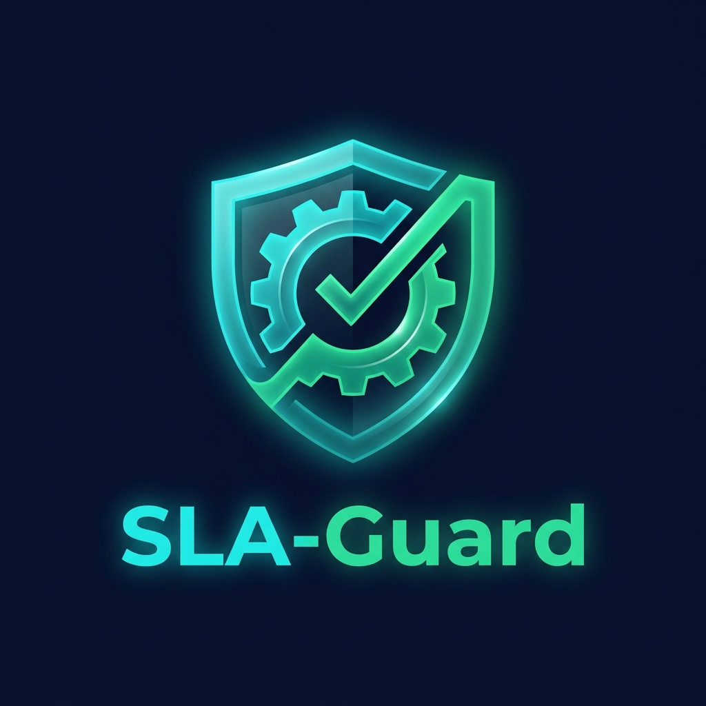

# SLA-Guard 🛡️

SLA-Guard is an advanced, AI-driven Compliance Control Room designed for enterprise customer support teams. It acts as an automated multi-agent consensus pipeline that audits drafted support responses against strict compliance boundaries, SLA targets, and billing caps before they are sent to customers.



## 🌟 Features

- **Multi-Agent Consensus Engine**: Simulates a multi-step audit process (Policy Retriever, SQL Account Verifier, and Policy Guardrail).
- **Dynamic Policy Enforcement**: Checks if drafted responses violate refund caps based on user tiers (e.g., Bronze, Silver, Gold, Enterprise).
- **Prompt Injection Defense**: Detects and neutralizes malicious overrides or prompt injection attempts from users.
- **Auto-Correction Loop**: If a draft fails compliance, the system automatically runs refinement iterations until the response is safe and compliant.
- **Premium Glassmorphism UI**: A gorgeous Bioluminescent Teal & Amber theme for a true "Control Room" aesthetic.

## 🏗️ Architecture & Deployment

The repository is split into a **Frontend** (Static) and a **Backend** (Python). 

### How it works in production (e.g., GitHub Pages)
GitHub Pages only hosts static files (HTML, CSS, JS). Since SLA-Guard requires a Python backend to run the AI compliance engine, the architecture is split:

1. **Frontend (Static UI)**: The files in the `static/` folder can be hosted directly on GitHub Pages, Vercel, or Netlify.
2. **Backend (API)**: The Python backend (`backend/` folder) must be deployed to a cloud provider like **Hugging Face Spaces**, Render, or Heroku. 
   - *Note: We have provided a `deploy_to_hf.py` script to easily push the backend to Hugging Face Spaces.*

Once the backend is deployed, you simply update the API endpoint URL in `static/app.js` (replace `http://127.0.0.1:8000` with your remote backend URL), and your static GitHub Pages site will successfully communicate with your live backend!

## 🚀 Running Locally

To test and run the full stack on your local machine:

### Prerequisites
- Python 3.8+
- Node.js (optional, for simple static serving)

### Setup
1. Clone the repository:
   ```bash
   git clone https://github.com/yourusername/sla_guard.git
   cd sla_guard
   ```

2. Install the backend dependencies:
   ```bash
   pip install -r requirements.txt
   ```

3. Run the application:
   You can start both the backend API and the frontend static server using the provided shell script:
   ```bash
   bash run_server.sh
   ```
   *The backend will run on port 8000, and the frontend UI will be available at `http://localhost:8080`.*

## 🧪 Testing

To run the automated Quality Assurance and Compliance tests (which test the engine against valid claims, invalid tier claims, and prompt injection attempts):
```bash
python backend/test_compliance.py
```

## 🎨 Theme & UI
SLA-Guard features a custom **Bioluminescent Teal & Amber** theme, complete with dynamic SVG gauges, interactive pipeline steps, and automated status updates representing the underlying LLM consensus process. 

---
*Designed & Engineered for secure, enterprise-grade AI support automation.*
